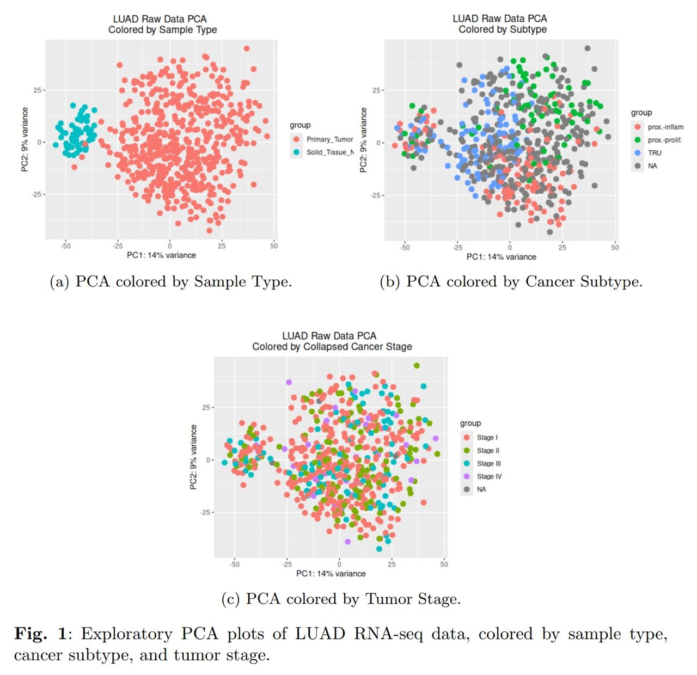
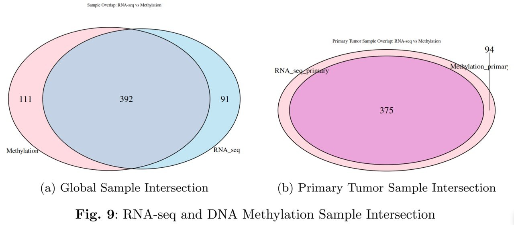
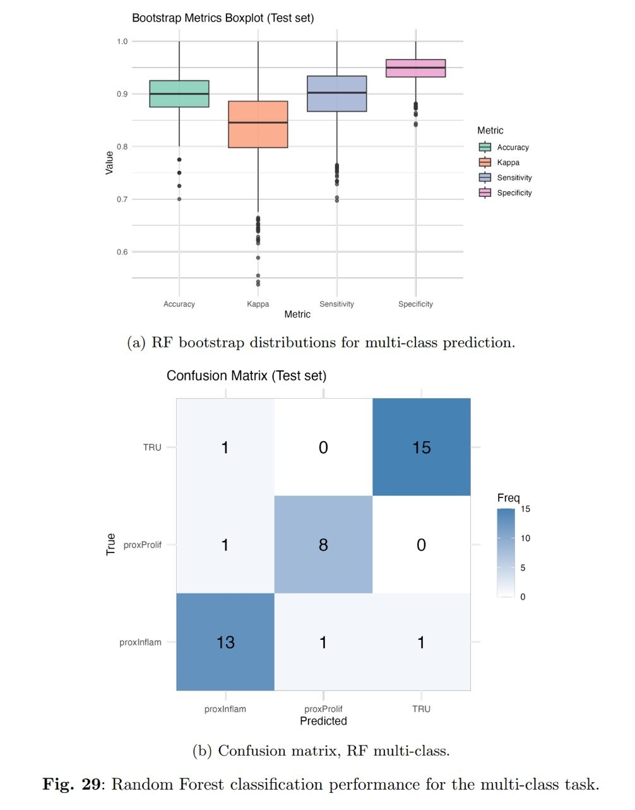
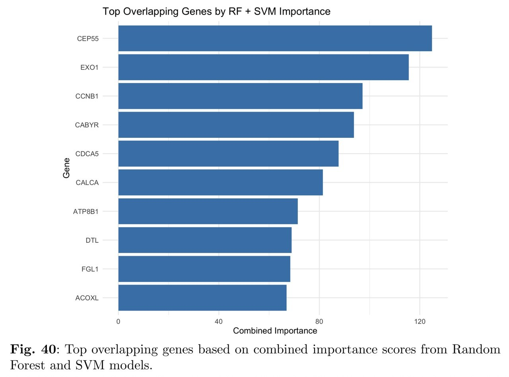

# LUAD Multi-Omics Classification

## Executive Summary

Lung adenocarcinoma (LUAD) is the most common subtype of lung cancer and exhibits substantial molecular heterogeneity. Accurate subtype identification is important for prognosis and treatment decisions but traditionally relies on extensive pathological assessment.

This project investigates whether lung cancer molecular subtypes can be predicted using integrated transcriptomic (RNA-seq) and epigenomic (DNA methylation) data from The Cancer Genome Atlas (TCGA).

Using a biologically driven feature selection strategy, differential expression and differential methylation analyses were combined to identify genes showing both transcriptional and epigenetic alterations. These features were then used to train Random Forest and Support Vector Machine classifiers capable of distinguishing LUAD molecular subtypes.

The resulting models achieved high predictive performance on independent test data, demonstrating the potential of multi-omics integration and machine learning for cancer subtype classification.

---

## Project Highlights

- Integrated RNA-seq, DNA methylation and clinical data
- Processed and matched samples from multiple TCGA sources
- Differential Expression Analysis (DESeq2)
- Differential Methylation Analysis (limma)
- Multi-omics feature engineering
- Random Forest and Support Vector Machine models
- Cross-validation and bootstrap validation
- Biological interpretation through pathway enrichment analysis

---

## Key Skills Demonstrated

* Multi-omics Data Integration
* Data Cleaning and Quality Control
* Statistical Analysis
* Differential Expression Analysis (DESeq2)
* Differential Methylation Analysis (limma)
* Feature Engineering
* Machine Learning
* Random Forest
* Support Vector Machines
* Cross Validation
* Bootstrap Validation
* Biological Pathway Analysis
* Data Visualization
* Reproducible Research
* R Programming

---

## Data Sources

- TCGA LUAD
- recount3
- TCGAbiolinks
- curatedTCGAData

---

## Workflow

```text
RNA-seq Data
       +
DNA Methylation Data
       +
Clinical Labels
          │
          ▼
Data Cleaning & Quality Control
          │
          ▼
Sample Matching Across Omics Layers
          │
          ▼
Differential Expression Analysis
(DESeq2)
          │
          ▼
Differential Methylation Analysis
(limma)
          │
          ▼
Feature Selection
(DEGs ∩ DMPs)
          │
          ▼
Multi-Omics Integration
          │
          ▼
Machine Learning Models
(Random Forest + SVM)
          │
          ▼
Model Evaluation
          │
          ▼
Biological Annotation
```
---

## Featured Results

### Exploratory Data Analysis

The PCA below illustrates the structure of the RNA-seq dataset before downstream modeling. Primary tumor samples separate clearly from normal tissue samples, while molecular subtypes show substantially stronger clustering patterns than tumor stages.

This early observation provided evidence that subtype classification would likely be more successful than stage classification and helped guide subsequent feature engineering and modeling decisions.



---

### Multi-Omics Sample Integration

A critical step of the project involved matching samples across transcriptomic and methylation datasets. Only samples present in both omics layers were retained for downstream analyses, ensuring that expression and methylation measurements originated from the same biological samples.



---

### Random Forest Multi-Class Classification

The Random Forest classifier achieved strong performance in distinguishing LUAD molecular subtypes using integrated transcriptomic and methylation features.

The model achieved approximately 89% accuracy on an independent test set and demonstrated stable performance through bootstrap validation.



---

### Biological Interpretation of Predictive Features

To improve interpretability, feature importance scores from Random Forest and Support Vector Machine models were combined to identify genes consistently associated with subtype prediction.

Several highly ranked genes, including CEP55, EXO1, and CCNB1, have previously been linked to lung adenocarcinoma progression and prognosis.



---

## Technologies

### Programming

- R

### Bioinformatics

- DESeq2
- limma
- Bioconductor

### Machine Learning

- Random Forest
- Support Vector Machines

### Data Science

- Feature Engineering
- Cross Validation
- Bootstrap Validation
- Data Visualization

---

## Repository Structure

```text
luad-multiomics-classification/
│
├── README.md
│   Project overview, workflow, results and instructions
│
├── ABOUT_THE_PROJECT.md
│   Project background, contributions and lessons learned
│
├── docs/
│   ├── README.md
│   └── Final_Project_Report.pdf
│
├── notebooks/
│   ├── README.md
│   ├── 01_data_preprocessing_and_integration.Rmd
│   ├── 02_feature_selection_and_model_training.Rmd
│   ├── 03_model_testing_and_evaluation.Rmd
│   └── 04_biological_annotation.Rmd
│
├── figures/
│   ├── README.md
│   └── project_figures
│
├── results/
│   ├── README.md
│   └── analysis_outputs
│
└── environment/
    ├── README.md
    └── session_info.txt

```

---

## Analysis Workflow

The notebooks are intended to be executed sequentially.

### 01 Data Preprocessing and Integration

- Download TCGA LUAD datasets
- Perform quality control
- Filter samples and genes
- Match RNA-seq and methylation samples
- Create training and testing datasets

### 02 Feature Selection and Model Training

- Differential expression analysis (DESeq2)
- Differential methylation analysis (limma)
- Multi-omics feature selection
- Random Forest training
- Support Vector Machine training

### 03 Model Evaluation

- Evaluate models on independent test data
- Generate confusion matrices
- Calculate performance metrics
- Bootstrap validation

### 04 Biological Annotation

- Pathway enrichment analysis
- Functional annotation
- Gene overlap analysis
- Biological interpretation

## Results

The biologically driven feature selection strategy successfully identified genes exhibiting both transcriptional and epigenetic alterations across LUAD molecular subtypes.

Machine learning models trained on these integrated features achieved strong predictive performance on independent test data.

| Model         | Classification Task | Accuracy |
| ------------- | ------------------- | -------- |
| Random Forest | PP vs PI            | 93.1%    |
| Random Forest | TRU vs PI           | 90.3%    |
| Random Forest | TRU vs PP           | 93.5%    |
| Random Forest | Multi-class         | 89.2%    |
| SVM           | Multi-class         | 84.2%    |

### Key Findings

* Molecular subtype prediction was substantially more successful than tumor stage prediction.
* Random Forest consistently outperformed Support Vector Machine models.
* Multi-omics integration enabled robust subtype classification.
* Transcriptomic features contributed more strongly to prediction than methylation features.
* Several highly ranked predictive genes have previously been associated with lung adenocarcinoma biology.

These results demonstrate the potential of combining transcriptomic and epigenomic information for interpretable cancer subtype classification.


---

## Academic Context

This project was developed as part of the Data Science in the Life Sciences course at Freie Universität Berlin and extended into a complete multi-omics machine learning workflow for lung adenocarcinoma subtype classification.

---

## Full Report

See:

`docs/Final_Project_Report.pdf`
